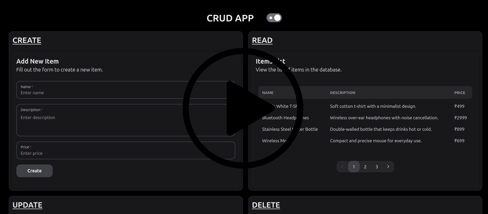

# Pull the repository

```
git clone https://github.com/karthikeya0800/CRUD-Node.git
```

To run the application, cd to CRUD-Node and use the following command:

```
docker compose up -d
```

- **Frontend server will run on port 5001**

- **Backend server will run on port 3000**

- **MongoDB will run on port 27017**

Ensure that the container port matches the port specified in the environment variable. If no port is explicitly set, the application will default to using port 5173.

```
environment:
      - API_URL=http://localhost:3000
      - PORT=5001
      - BACKEND_FRAMEWORK=Express.js
    ports:
      - '5000:5001'
```

To stop the application, use the following command:

```
docker compose down
```

To delete containers, images, volumes, and unused networks, use the following command:

_Note: Only works on Linux_

```
sh clear-docker.sh
```

If port is in use, change it in docker-compose.yml or use the command below to kill the process. Then **restart the container**.

_Note: Only works on Linux_

```
sh kill-port.sh <port_number>
```

<br>

# App video

[](https://youtu.be/v-hkX_6a-XE)
